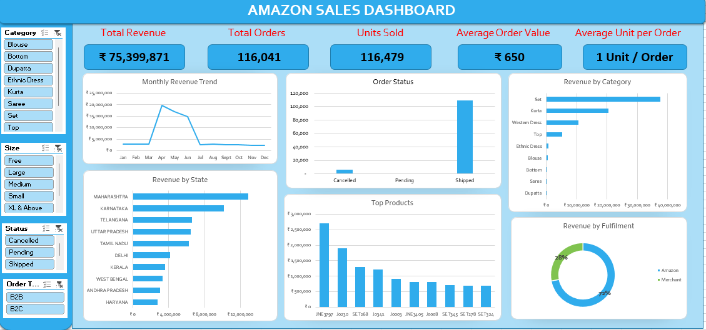

# Amazon Sales Analysis

## Overview
This project presents an interactive sales dashboard built in Microsoft Excel to analyze clothing sales from Amazon. The dashboard transforms raw transactional data into meaningful business insights using Pivot Tables, Pivot Charts, slicers, and KPI cards.

The objective is to help business stakeholders monitor sales performance, evaluate order fulfillment, identify top-performing product categories, and support data-driven decision-making.

## Business Problem and Objectives

E-commerce businesses generate large volumes of transactional data every day. Without effective reporting, it becomes difficult to identify sales trends, monitor operational performance, and make informed business decisions.

This dashboard was developed to answer key business questions such as:

- Which product categories generate the highest revenue?
- How many orders were successfully fulfilled?
- Which fulfillment method generate the highest revenue?
- What are the monthly sales trends?
- Which categories require marketing attention?

## Dataset
The dataset contains transactional records for clothing sales on Amazon in the Indian market for the period of 2022. Data Source: Kaggle.

### Key Fields
Order Date, Product Category, Product Size, Quantity Sold, Sales Amount (INR), Order Status, Fulfillment Method, Shipping Status, Business Type (B2B/B2C)

## Dashboard Preview

## Dashboard Features

- KPIs
    - Total Revenue
    - Total Orders
    - Units Sold
    - Average Order Value
    - Average Unit per Order
- Interactive slicers
- Monthly sales trend analysis
- Product category performance
- Fulfillment and order status analysis
- State performance by revenue

## Key Insights
- Revenue exceeded ₹75 million from more than 116,000 orders.
- Clothing Set category generated the highest revenue.
- Nearly all orders were successfully shipped, indicating an efficient fulfillment process.
- Sales peaked during the middle of the period, 2022.
- The Dupatta category contributed relatively less revenue and may benefit from targeted promotional campaigns.
